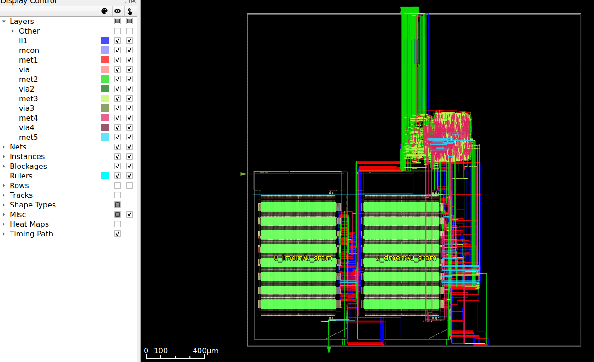
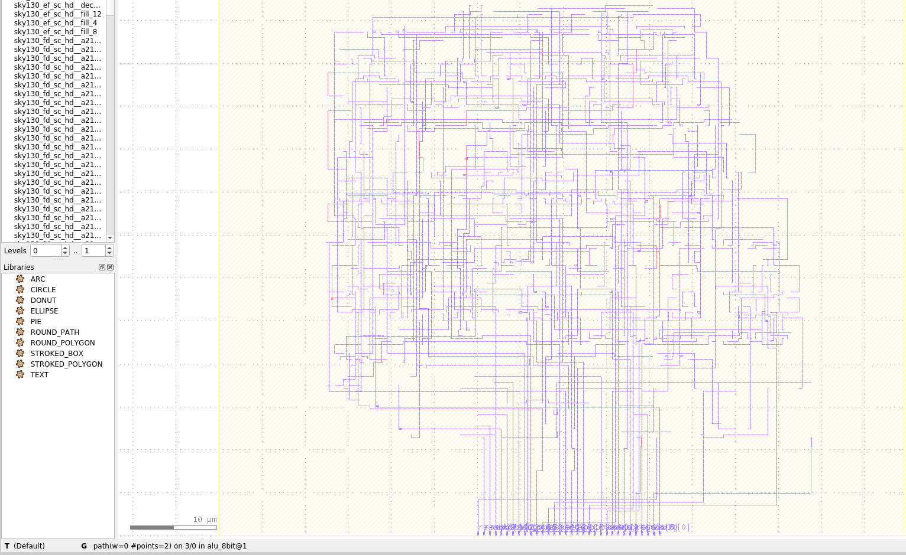

# Physical Design: RTL to GDSII

Complete RTL-to-GDSII implementations using open-source EDA tools across three process nodes (7nm, 45nm, 130nm).

---

## Projects

### RISC-V RV32I — Sky130 (130nm)

5-stage pipelined RISC-V processor with real OpenRAM SRAM macros.

| Metric | Value |
|--------|-------|
| Target Frequency | 100 MHz |
| Total Area | 1.55 mm² |
| Total Cells | 9,804 |
| Power | 90.3 mW |
| WNS (Setup) | -0.05 ns |
| WNS (Hold) | +0.07 ns |
| SRAM | 2× 4KB OpenRAM macros |
| Status | **Complete** (Synthesis → Signoff) |

<p align="center">
  
  
  
</p>

```
riscv-sky130/
├── src/          # 11 Verilog modules (core + SRAM wrappers)
├── scripts/      # 01_synthesis.ys → 06_signoff.tcl
├── constraints/  # SDC (100 MHz)
├── results/      # DEF, netlists, reports
└── docs/         # Screenshots, quizzes
```

### RISC-V RV32I — ASAP7 (7nm)

Same pipeline targeting 500 MHz on a 7nm FinFET node. SRAM synthesized to flip-flops (no ASAP7 SRAM macro available).

| Metric | Value |
|--------|-------|
| Target Frequency | 500 MHz |
| Design Area | 19,106 µm² |
| Total Cells | 164,673 |
| Clock Skew | 35 ps |
| CTS Buffers | 6,303 |
| CTS Depth | 8 levels |
| Status | **Complete through CTS** (Phase 5/7) |

<p align="center">
  
  
</p>

```
riscv-asap7/
├── src/          # 10 Verilog modules (core + fake SRAM)
├── scripts/      # 01_synthesis.ys → 06_signoff.tcl
├── constraints/  # SDC (500 MHz)
├── results/      # DEF, netlists, reports
└── docs/         # Screenshots, quizzes
```

### 8-bit ALU — Sky130 (130nm)

Simple educational design — complete RTL-to-GDSII flow.

| Metric | Value |
|--------|-------|
| Frequency | 50 MHz |
| Area | 1,485 µm² |
| Cells | 214 |
| Power | 56 µW |
| Setup Slack | +15.19 ns |
| Status | **Complete** (RTL → GDSII) |

<p align="center">
  
</p>

```
project_alu8bits/
├── designs/      # RTL (alu_8bit.v) + SDC constraints
├── scripts/      # 01_synthesis.tcl → 08_gdsii_export.sh
└── results/      # Outputs for all 8 phases
```

---

## RISC-V Architecture

Both RISC-V projects share the same 5-stage pipeline:

```
riscv_soc
├── riscv_core
│   ├── IF  — Instruction Fetch
│   ├── ID  — Decode + Register File (32×32)
│   ├── EX  — ALU + Branch Unit
│   ├── MEM — Memory Access
│   └── WB  — Write Back
│   └── Hazard Detection + Data Forwarding
├── IMEM (4KB Instruction Memory)
├── DMEM (4KB Data Memory)
└── GPIO (32-bit)
```

| Feature | Sky130 | ASAP7 |
|---------|--------|-------|
| Process | 130nm CMOS | 7nm FinFET |
| VDD | 1.8V | 0.7V |
| Clock | 100 MHz | 500 MHz |
| Metal Layers | 5 (li1–met5) | 9 (M1–M9) |
| SRAM | Real macros (OpenRAM) | Synthesized (flip-flops) |

---

## PDKs

| PDK | Node | Source | Used In |
|-----|------|--------|---------|
| **ASAP7** | 7nm FinFET | Arizona State University | riscv-asap7 |
| **Nangate45** | 45nm | Si2 (open-source) | pd-puzzles |
| **Sky130** | 130nm | SkyWater / Google | riscv-sky130, ALU project |

---

## Learning Resources

### Structured Lessons (`phases/`)

| Phase | Topic | Content |
|-------|-------|---------|
| Phase 0 | Foundations | TCL scripting (7 lessons), OpenSTA basics (6 exercises) |
| Phase 1 | Floorplanning | Die/Core area, utilization, I/O placement |

### PD Puzzles (`pd-puzzles/`)

30 interactive debugging challenges across 6 categories, with progressive difficulty (Beginner → Intermediate → Advanced):

| Category | Puzzles | Example |
|----------|---------|---------|
| Synthesis | 5 | Missing library, multi-corner PVT, multi-Vt |
| Floorplanning | 5 | PDN setup, halos, density management |
| Placement | 5 | Density control, timing-driven, padding |
| CTS | 5 | Buffer selection, sink clustering, skew |
| Routing | 5 | Layer config, NDR rules, congestion |
| Signoff | 5 | STA constraints, multi-corner, DRC |

Each puzzle includes: `PROBLEM.md` → `run.tcl` (with TODOs) → `hints.md` → `QUIZ.md` → `.solution/`

### Study Notes (`notes/`)

Comprehensive notes covering each stage of the PD flow and TCL scripting (kept locally, not tracked in git).

---

## Tools

| Tool | Version | Purpose |
|------|---------|---------|
| **OpenROAD** | Latest | Floorplanning, placement, CTS, routing |
| **Yosys** | Latest | Logic synthesis (RTL → gate-level) |
| **OpenSTA** | Latest | Static timing analysis |
| **KLayout** | Latest | GDSII visualization |
| **Docker** | Optional | Containerized tool environment |

### Setup

```bash
# Option 1: Docker (recommended)
./docker_openroad.sh openroad

# Option 2: Native install
# See OpenROAD installation guide:
# https://openroad.readthedocs.io/en/latest/user/Build.html

# Verify tools
openroad -version
yosys -version
```

### Docker Usage

```bash
./docker_openroad.sh                         # Interactive shell
./docker_openroad.sh openroad script.tcl     # Run a TCL script
./docker_openroad.sh yosys script.ys         # Run synthesis
```

---

## Physical Design Flow

```
RTL (Verilog)
    │
    ▼
┌─────────────┐
│  Synthesis   │  Yosys — RTL → gate-level netlist
└─────────────┘
    │
    ▼
┌─────────────┐
│ Floorplan    │  OpenROAD — die/core area, macros, I/O, PDN
└─────────────┘
    │
    ▼
┌─────────────┐
│  Placement   │  OpenROAD — standard cell positioning, optimization
└─────────────┘
    │
    ▼
┌─────────────┐
│     CTS      │  OpenROAD — clock tree, buffer insertion, skew
└─────────────┘
    │
    ▼
┌─────────────┐
│   Routing    │  OpenROAD — global + detailed routing, DRC fix
└─────────────┘
    │
    ▼
┌─────────────┐
│  Sign-off    │  OpenSTA — STA, power, DRC, LVS, antenna, EM
└─────────────┘
    │
    ▼
   GDSII
```

---

## Repository Structure

```
Physical-Design/
│
├── riscv-sky130/              # RISC-V on Sky130 (130nm) — COMPLETE
├── riscv-asap7/               # RISC-V on ASAP7 (7nm)   — Through CTS
├── project_alu8bits/          # 8-bit ALU on Sky130      — COMPLETE (RTL→GDSII)
│
├── phases/                    # Structured learning path
│   ├── phase_00_foundations/  #   TCL scripting + OpenSTA
│   └── phase1_floorplanning/  #   Die/core concepts
│
├── pd-puzzles/                # 30 interactive challenges
│   ├── puzzles/               #   6 categories × 5 levels
│   ├── tcl_fundamentals/      #   TCL crash course
│   └── common/pdks/nangate45/ #   Nangate45 PDK
│
├── notes/                     # Study notes (local only)
├── docker_openroad.sh         # Docker integration
└── view_layout.sh             # KLayout visualization
```

---

## Resources

- [OpenROAD Documentation](https://openroad.readthedocs.io/)
- [Yosys Manual](https://yosyshq.readthedocs.io/)
- [Sky130 PDK](https://skywater-pdk.readthedocs.io/)
- [ASAP7 PDK Reference](https://asap.asu.edu/asap/)

---

## Author

**Faiz MOHAMMAD** — [GitHub](https://github.com/HaiderIII) — faiz.mohammad.pro@protonmail.com
