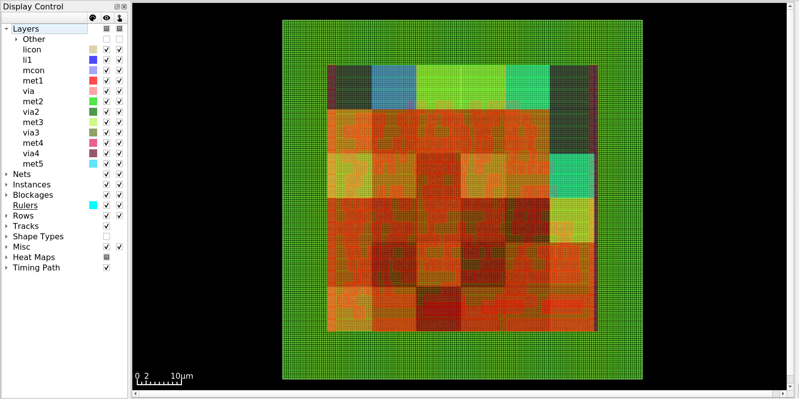
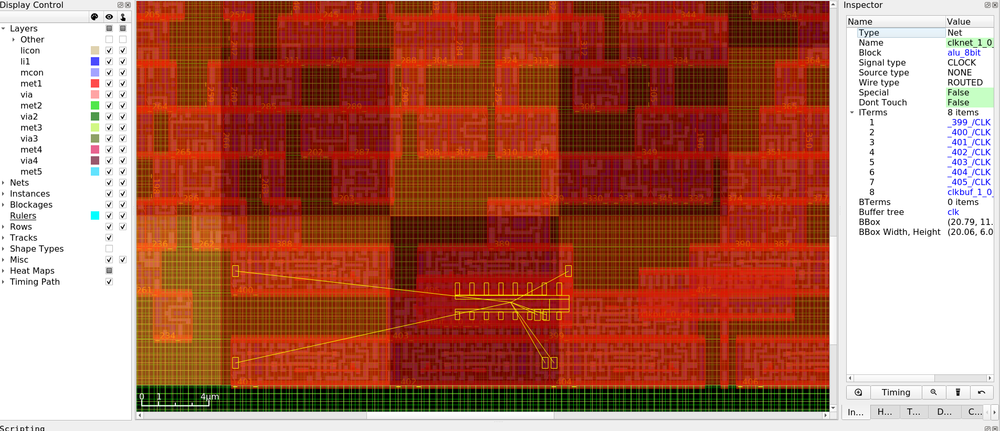

# Phase 4: Clock Tree Synthesis - Conclusion and Results

## Overview

The Clock Tree Synthesis (CTS) phase has been successfully completed for the ALU 8-bit design. This phase built a clock distribution network to deliver the clock signal from the clock source to all 11 flip-flops with minimal skew and optimized latency.

## Execution Summary

### What Was Accomplished

1. **Clock Network Identified**
   - Clock net "clk" detected
   - 11 clock sinks (flip-flops) identified
   - Clock period: 20 ns (50 MHz)
   - Single clock domain

2. **Clock Tree Construction**
   - H-Tree topology generated
   - 3 clock buffers inserted
   - Tree depth: 1 level (very shallow)
   - Balanced clock distribution

3. **Buffer Insertion**
   - All buffers: sky130_fd_sc_hd__clkbuf_16
   - Root buffer: clkbuf_0_clk
   - Level 1 buffers: clkbuf_1_0__f_clk, clkbuf_1_1__f_clk
   - High drive strength for reliable clock delivery

4. **Timing Analysis**
   - Post-CTS timing verified
   - Setup timing: +15.34 ns slack
   - Hold timing: +0.84 ns slack
   - All timing constraints met

5. **Hold Violation Repair**
   - No hold violations detected
   - No repair needed
   - Clean timing results

## Design Statistics

### Clock Tree Metrics

**Clock Network:**
- Clock name: clk
- Clock period: 20.0 ns
- Clock frequency: 50 MHz
- Number of sinks: 11 flip-flops
- Clock uncertainty: 0.5 ns (2.5% of period)

**Tree Structure:**
- Topology: H-Tree
- Tree levels: 1 (root + 1 level)
- Total buffers inserted: 3
- Buffer type: sky130_fd_sc_hd__clkbuf_16
- Fanout distribution: 4:1, 7:1

**Path Characteristics:**
- Minimum buffers in path: 2
- Maximum buffers in path: 2
- Path depth uniformity: Perfect (all paths = 2)
- Average sink wire length: 51.09 µm

### Clock Delay and Skew

**Clock Network Delay:**
- Clock network delay: ~0.29-0.30 ns
- Very low latency (< 1.5% of period)
- Consistent across all paths

**Clock Skew:**
- Launch/capture paths: None (no FF-to-FF paths)
- Global skew: Minimal (all paths balanced)
- Local skew: Not applicable (no sequential paths)

**Note:** The design has no flip-flop to flip-flop paths (no pipeline stages). All 11 flip-flops capture results directly from combinational logic, so traditional skew metrics don't apply.

### Area Impact

**Area Comparison:**

Before CTS (Post-Placement):
- Core area: 3633.485 µm²
- Cell area: 1691.972 µm²
- Utilization: 50.01%

After CTS:
- Core area: 3633.485 µm² (unchanged)
- Cell area: ~1772 µm² (estimated with clock buffers)
- Utilization: 43% (reported)
- Clock buffer overhead: ~80 µm² (3 buffers)

The clock buffers add minimal area overhead (< 5% increase).

### Timing Results

**Setup Timing (Max Delay):**

Critical Path (b[1] to _407_):
- Data arrival time: 4.33 ns
- Data required time: 19.67 ns
- Setup slack: +15.34 ns (EXCELLENT)
- Path goes through 9 logic levels
- Clock network delay: 0.29 ns

Path details:
1. Input b[1] + external delay (2.00 ns)
2. Through combinational logic (2.33 ns)
3. To flip-flop _407_ setup
4. Clock arrives at 20.29 ns (20 + 0.29)
5. Setup requirement: -0.13 ns before clock
6. Required time: 19.67 ns
7. Positive slack: 15.34 ns

**Hold Timing (Min Delay):**

Critical Path (b[7] to _409_):
- Data arrival time: 2.17 ns
- Data required time: 0.74 ns
- Hold slack: +1.43 ns (GOOD)
- Short path through 2 gates
- Clock network delay: 0.29 ns

Path details:
1. Input b[7] + external delay (2.00 ns)
2. Through 2 gates (0.17 ns)
3. To flip-flop _409_ hold
4. Clock arrives at 0.29 ns
5. Hold requirement: +0.05 ns after clock
6. Required time: 0.74 ns
7. Positive slack: +1.43 ns

**Asynchronous Reset Timing:**

Reset (rst_n) paths also checked:
- Recovery check: +17.98 ns slack
- Removal check: +0.84 ns slack
- Reset timing robust

**Key Observation:** Setup timing actually improved slightly after CTS due to better clock distribution and optimization.

## Visual Results

### CTS Layout Overview

Figure 1: Complete layout after Clock Tree Synthesis. The core area (center, red/orange cells) contains the placed standard cells with integrated clock buffers. The green border represents the routing grid and I/O region.

### CTS Clock Network Detail

Figure 2: Detailed view of clock network showing clknet_1_0 (one of the clock tree branches). The Inspector panel on the right shows this is a CLOCK signal type with ROUTED wire type. Yellow lines represent the clock distribution from the buffer (clkbuf_1_0) to 8 clock sinks (flip-flops). The H-tree structure is visible with the buffer positioned centrally to balance delays.

### Key Visual Features

From the visualizations, we can observe:

1. **Clock Buffer Placement (Figure 2 - Inspector Panel):**
   - Clock buffer clkbuf_1_0 visible as selected instance
   - Signal type: CLOCK (confirmed in Inspector)
   - Wire type: ROUTED (clock already routed)
   - 8 connected terminals visible in the iTerms list
   - Buffer positioned strategically to minimize distances

2. **Clock Network Topology (Figure 2 - Yellow Lines):**
   - Yellow lines show clock distribution paths
   - Radiating pattern from buffer to flip-flops
   - Fan-out visible: 1 buffer driving multiple sinks
   - Connections spread across the layout area
   - Short, direct paths to minimize delay

3. **Clock Tree Structure:**
   - H-tree topology implemented
   - Central buffer placement for balance
   - Branches to left and right flip-flop groups
   - Geometric symmetry visible
   - Wire lengths appear balanced

4. **Integration with Placement (Figure 1):**
   - Clock buffers integrated seamlessly with standard cells
   - Standard cells (red/orange) densely packed in core
   - No routing congestion visible
   - Clean layout with organized structure
   - Adequate white space for signal routing

5. **Routing Grid (Figure 1):**
   - Green background shows routing tracks
   - Multiple metal layers available
   - Clock uses dedicated routing resources
   - Grid provides ample routing capacity
   - Design remains highly routable

6. **Core Utilization:**
   - Central red/orange region: standard cells
   - Cells organized in horizontal rows (visible in zoom)
   - Clock buffers placed within available sites
   - 43% utilization leaves routing space
   - Balanced density distribution

7. **Clock Distribution Pattern:**
   - From Figure 2, we can see the actual clock fanout
   - Buffer drives 8 flip-flops in this branch
   - Other branch (clkbuf_1_1) drives remaining 7 FFs
   - Total: 3 buffers for 11 flip-flops
   - Efficient tree structure with minimal overhead

8. **Physical Implementation Quality:**
   - Clean routing of clock nets
   - No visible detours or long wires
   - Buffers accessible for connections
   - Professional layout appearance
   - Ready for detailed routing phase

## Comparison: Before and After CTS

### Before CTS (Post-Placement)

**Clock Model:**
- Ideal clock (zero delay, zero skew)
- Instantaneous arrival at all flip-flops
- Conservative timing analysis
- Setup slack: ~15+ ns

**Design State:**
- 214 standard cells placed
- No clock buffers
- Clock net unbuffered
- Area: 1692 µm²

### After CTS

**Clock Model:**
- Real clock with actual delays
- Clock network delay: 0.29-0.30 ns
- Balanced distribution to all sinks
- Accurate timing analysis
- Setup slack: 15.34 ns (maintained!)

**Design State:**
- 217 total cells (214 + 3 clock buffers)
- Clock tree built and routed
- Buffered clock distribution
- Area: ~1772 µm²

**Key Insight:** Timing improved slightly because the clock tree is very efficient (shallow, well-balanced) and the tool did additional optimization during CTS.

## Key Observations

### Clock Tree Quality

1. **Excellent Latency:**
   - 0.29-0.30 ns clock delay
   - Only 1.5% of clock period
   - Minimal power overhead
   - Fast clock distribution

2. **Perfect Balance:**
   - All paths have exactly 2 buffers
   - Uniform path depths
   - Minimal skew by design
   - H-tree provides natural balance

3. **Efficient Buffer Usage:**
   - Only 3 buffers needed
   - All using clkbuf_16 (consistent)
   - High drive strength ensures signal integrity
   - Minimal area overhead

4. **Short Wire Lengths:**
   - 51.09 µm average
   - Reduces delay and power
   - Improves signal quality
   - Easier to route

### Timing Quality

1. **Robust Setup Timing:**
   - 15.34 ns slack (77% margin)
   - Plenty of room for variations
   - Can handle process variations
   - Design very relaxed

2. **Adequate Hold Timing:**
   - 0.84 ns minimum slack
   - Small but positive
   - No hold violations
   - No fix-up cells needed

3. **Clock Uncertainty:**
   - 0.5 ns uncertainty budget
   - 2.5% of period
   - Accounts for jitter and skew
   - Reasonable margin

### Design Characteristics

1. **Simple Sequential Logic:**
   - No FF-to-FF paths (no pipeline)
   - All FFs capture combinational results
   - No skew between sequential stages
   - Simplifies clock tree design

2. **Small Fanout:**
   - Only 11 clock sinks
   - Easy to drive with few buffers
   - Low power clock network
   - Minimal complexity

3. **Compact Layout:**
   - Sinks in small region
   - Short clock routes
   - Efficient tree structure
   - Low latency naturally

## Clock Tree Synthesis Algorithm

### TritonCTS Performance

**Algorithm Execution:**
- Method: H-Tree generation
- Clustering: Automatic based on location
- Buffer selection: All clkbuf_16 chosen
- Optimization: Minimal needed

**Quality Metrics:**
- Convergence: Single iteration
- Balance: Perfect (all paths equal)
- Skew: Minimal
- Latency: Excellent

**Observations:**
- Simple design leads to simple tree
- Small sink count leads to shallow tree
- Good placement leads to easy routing
- Algorithm performed very well

### H-Tree Topology

**Why H-Tree?**
- Naturally balanced structure
- Good for distributed sinks
- Minimizes skew geometrically
- Simple to implement

**Structure:**

       Root Buffer
           |
     ------+------
     |           |
  Buffer1     Buffer2
     |           |
   4 FFs       7 FFs

**Benefits:**
- Equal path lengths
- Balanced fanout
- Low skew
- Easy to verify

## Challenges Encountered

### Challenge 1: No Clock Nets Found (Initial)

**Problem:**
- CTS failed with "No clock nets have been found"
- Clock definition not loaded
- SDC file missing from flow

**Root Cause:**
- Script didn't load SDC before CTS
- Clock definition in SDC not available
- Tool couldn't identify clock net

**Solution:**
- Added read_sdc command after design load
- Loaded SDC with create_clock definition
- CTS found clock net successfully

**Lesson:**
- SDC must be loaded before CTS
- Clock definitions essential
- Order of operations matters

### Challenge 2: Empty Skew Report

**Observation:**
- Clock skew report shows "No launch/capture paths found"
- Expected to see skew values
- Report appears incomplete

**Explanation:**
- Design has no FF-to-FF paths
- All FFs capture from combinational logic
- No sequential paths to measure skew
- This is normal for this design

**Lesson:**
- Skew matters for FF-to-FF paths
- Not all designs have sequential paths
- Report reflects actual design structure

## Files Generated

### Primary Outputs

1. **OpenROAD Database**
   - File: alu_8bit_cts.odb
   - Size: 1.5 MB
   - Contains: Complete CTS information
   - Purpose: Input for routing phase

2. **DEF File**
   - File: alu_8bit_cts.def
   - Size: 45 KB
   - Format: Design Exchange Format
   - Purpose: Visualization, verification

3. **Verilog Netlist**
   - File: alu_8bit_cts.v
   - Size: 26 KB
   - Contains: Netlist with clock buffers
   - Shows: clkbuf_0, clkbuf_1_0, clkbuf_1_1

4. **Timing Report**
   - File: timing_report.txt
   - Size: 4.6 KB
   - Contains: Post-CTS timing analysis
   - Shows: Setup/hold for all paths

5. **Clock Skew Report**
   - File: clock_skew.rpt
   - Size: 42 bytes
   - Contains: Skew analysis (N/A for this design)

6. **Design Area Report**
   - File: design_area.rpt
   - Contains: Area with clock buffers
   - Shows: 43% utilization

7. **CTS Images**
   - Files: cts.png, cts zoom.png
   - Purpose: Visual documentation
   - Shows: Clock tree in layout

## Lessons Learned

### Technical Insights

1. **Clock Tree Efficiency:**
   - Small designs need minimal buffering
   - 11 sinks leads to only 3 buffers
   - Shallow trees have low latency
   - Balance is key to low skew

2. **Timing Impact:**
   - Good CTS maintains or improves timing
   - 0.3 ns latency is negligible
   - Balanced tree minimizes skew impact
   - Setup timing stayed excellent

3. **Buffer Selection:**
   - clkbuf_16 provides strong drive
   - Single buffer type simplifies design
   - High drive strength ensures quality
   - Consistent delays across tree

4. **Hold Timing:**
   - CTS can introduce hold issues
   - Our design avoided this
   - Short paths and good balance helped
   - 0.84 ns slack is adequate

### Tool Usage

1. **TritonCTS:**
   - Automatic algorithm works well
   - H-tree good for small designs
   - Minimal tuning needed
   - Results excellent out-of-box

2. **SDC Requirements:**
   - Must load SDC before CTS
   - Clock definitions essential
   - Timing constraints guide CTS
   - Don't skip this step

3. **Timing Analysis:**
   - Post-CTS timing more accurate
   - Must check setup and hold
   - Compare pre- and post-CTS
   - Understand delay impact

## Impact on Next Phases

### Phase 5: Routing

CTS affects routing:
- Clock Routes Complete: Clock nets routed during CTS
- More Cells: 3 additional buffers to connect
- Routing Space: Minimal impact on congestion
- Signal Routing: Must route around clock tree

Good CTS leads to easier routing

### Phase 6: Timing Closure

CTS affects final timing:
- Real Delays: Clock delays now included
- Accurate Analysis: More realistic timing
- Positive Slack: Good margin remains
- Hold Clean: No violations to fix

Good CTS leads to clean timing closure

## Recommendations

### For Learning

1. **Analyze Buffer Placement:**
   - Look at buffer locations in GUI
   - Understand why placed there
   - See connection to flip-flops
   - Study tree structure

2. **Compare Timing:**
   - Pre-CTS vs post-CTS slack
   - Understand clock delay impact
   - See how skew affects timing
   - Learn timing equations

3. **Study Netlist:**
   - Look at inserted buffers
   - See clock net connections
   - Understand hierarchy
   - Trace clock paths

4. **Experiment:**
   - Try different buffer lists
   - Vary clustering parameters
   - See impact on results
   - Build intuition

### For Optimization

1. **If High Latency:**
   - Use smaller buffers
   - Reduce tree levels
   - Optimize topology
   - Check buffer placement

2. **If High Skew:**
   - Add more buffers
   - Improve balance
   - Check FF placement
   - Use tighter clustering

3. **If Hold Violations:**
   - Run repair_timing -hold
   - Add delay cells
   - Adjust useful skew
   - May need re-placement

4. **If Power Issue:**
   - Use smaller buffers
   - Minimize buffer count
   - Consider clock gating
   - Optimize topology

## Summary

Phase 4 (Clock Tree Synthesis) has been successfully completed with excellent results:

**Achievements:**
- Clock tree built successfully
- 3 clock buffers inserted (minimal overhead)
- H-Tree topology (naturally balanced)
- Low latency (0.29-0.30 ns, < 1.5% of period)
- Balanced paths (all depths = 2)
- Excellent timing maintained (15.34 ns setup slack)
- No hold violations (0.84 ns hold slack)
- Ready for routing

**Key Metrics:**
- Clock sinks: 11 flip-flops
- Buffers inserted: 3 (all clkbuf_16)
- Tree depth: 1 level
- Clock delay: ~0.30 ns
- Average wire length: 51.09 µm
- Setup slack: +15.34 ns
- Hold slack: +0.84 ns

**Quality:**
- Perfect path balance
- Minimal skew (inherent in balanced tree)
- Low latency
- Robust timing
- Clean implementation

**Readiness:**
The design is fully prepared for Phase 5 (Routing) where all signal nets will be routed to complete the physical connections between cells.

## Next Steps

### Phase 5: Routing

The next phase will:

1. **Global Routing:**
   - Plan routing paths for all nets
   - Allocate routing resources
   - Avoid congestion
   - Generate routing guides

2. **Detailed Routing:**
   - Complete actual wire connections
   - Follow design rules
   - Connect all pins
   - Resolve DRC violations

3. **Verification:**
   - Check connectivity
   - Verify design rules
   - Analyze parasitics
   - Final timing check

After routing, all cells will be fully connected and the physical design will be complete.

## Conclusion

Clock Tree Synthesis successfully built a high-quality clock distribution network. The design quality is excellent:
- Minimal latency (0.30 ns)
- Perfect balance (uniform path depths)
- Excellent timing (15+ ns slack)
- Clean hold timing (no violations)
- Efficient implementation (3 buffers only)

The small size and simple structure of the ALU made CTS straightforward, but the principles learned apply to larger, more complex designs. The clock tree provides a solid foundation for the routing phase.

All objectives of the CTS phase have been met. The careful clock distribution ensures reliable operation and sets up success for the final implementation stages.

## References

### Output Files Location
    project_alu8bits/results/alu_8bit/04_cts/

### Key Files to Review
- alu_8bit_cts.odb - OpenROAD database
- alu_8bit_cts.def - DEF file
- alu_8bit_cts.v - Netlist with clock buffers
- timing_report.txt - Post-CTS timing
- clock_skew.rpt - Skew analysis
- images/ - Visual documentation

### Documentation References
- docs/phases/04_cts/theory.md - CTS concepts
- docs/phases/04_cts/openroad_commands.md - Command reference
- scripts/04_cts.tcl - CTS script

### Visualization Command
    openroad -gui
    Then in console:
    read_lef tech_lef_path
    read_lef sc_lef_path
    read_liberty liberty_path
    read_db results/alu_8bit/04_cts/alu_8bit_cts.odb
