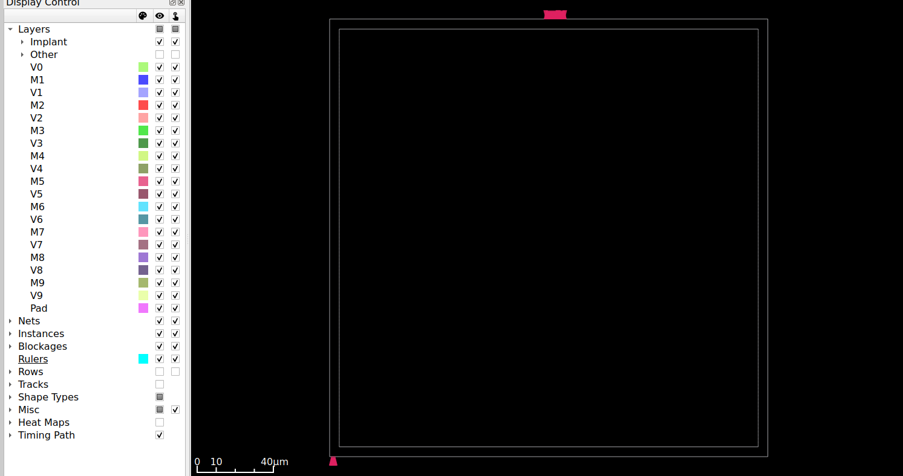
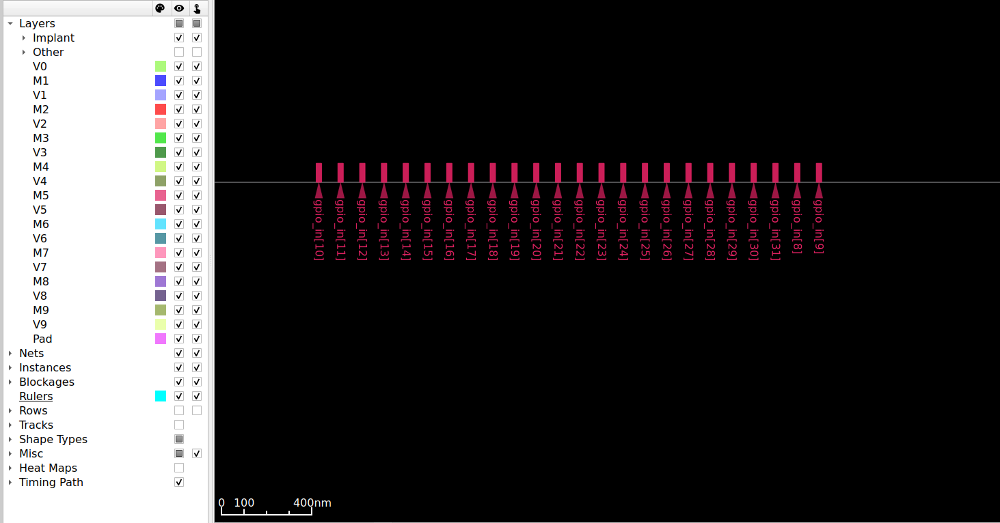
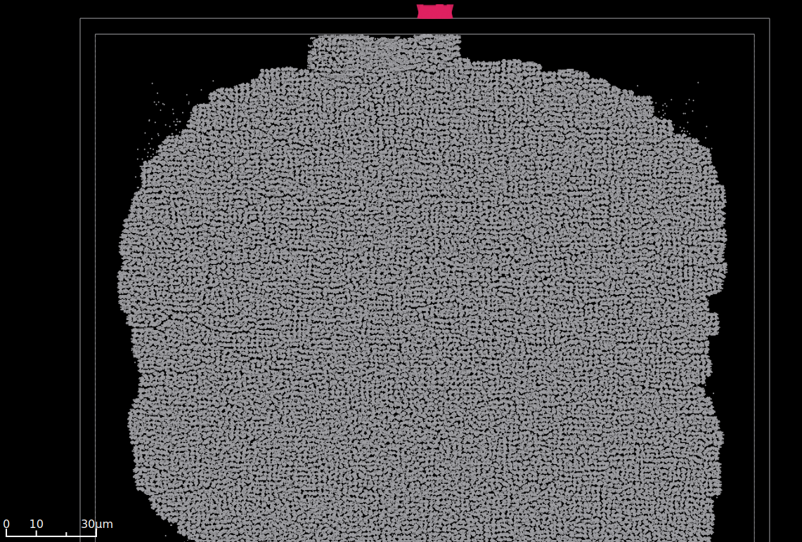

# RISC-V RV32I Physical Design Project - ASAP7 (7nm)

## Project Overview

| Attribute | Value |
|-----------|-------|
| **Design** | RISC-V RV32I 5-Stage Pipeline CPU |
| **Target PDK** | ASAP7 (7nm FinFET) |
| **Target Frequency** | 500 MHz (2ns period) |
| **Standard Cells** | asap7sc7p5t |
| **SRAM** | Fake SRAM (synthesized to flip-flops) |
| **Tools** | Yosys + OpenROAD |

## Architecture

```
┌─────────────────────────────────────────────────────────────────┐
│                         riscv_soc                               │
│  ┌──────────────────────────────────────────────────────────┐  │
│  │                     riscv_core                           │  │
│  │  ┌─────┐  ┌─────┐  ┌─────┐  ┌─────┐  ┌─────┐           │  │
│  │  │ IF  │→ │ ID  │→ │ EX  │→ │ MEM │→ │ WB  │           │  │
│  │  └─────┘  └─────┘  └─────┘  └─────┘  └─────┘           │  │
│  │     ↑        │        │                                  │  │
│  │     └────────┴────────┘ (Forwarding & Hazard)           │  │
│  └──────────────────────────────────────────────────────────┘  │
│  ┌────────────────┐  ┌────────────────┐  ┌────────────┐       │
│  │  IMEM (SRAM)   │  │  DMEM (SRAM)   │  │    GPIO    │       │
│  │  Fake (FF)     │  │   Fake (FF)    │  │   32-bit   │       │
│  └────────────────┘  └────────────────┘  └────────────┘       │
└─────────────────────────────────────────────────────────────────┘
```

## Fake SRAM vs Real SRAM

| Aspect | Real SRAM (SKY130) | Fake SRAM (ASAP7) |
|--------|-------------------|-------------------|
| **Implementation** | Hard macro (OpenRAM) | Flip-flops |
| **Synthesis** | Blackboxed | Fully synthesized |
| **Area** | Compact (~0.7 mm²) | Large (many FFs) |
| **Timing** | Fixed (from .lib) | Depends on synthesis |
| **Why?** | Macro available | No ASAP7 SRAM macro |

---

## Progress Tracker

### Phase 1: RTL Design ✅
- [x] RISC-V core (same as SKY130)
- [x] Fake SRAM module (synthesizable)
- [x] Top-level SoC integration
- [x] Verify synthesis compatibility

### Phase 2: Synthesis ✅
- [x] Yosys synthesis to ASAP7 cells
- [x] Gate count: **164,673 cells** (32,800 DFFs for fake SRAM)
- [x] ABC mapping with AO/OA/INVBUF/SIMPLE libraries

**Synthesis Statistics:**
| Cell Type | Count |
|-----------|-------|
| DFFHQNx1_ASAP7_75t_R | 32,800 |
| DFFASRHQNx1_ASAP7_75t_R | 474 |
| AOI21xp33_ASAP7_75t_R | 32,576 |
| NOR2xp33_ASAP7_75t_R | 35,082 |
| AND2x2_ASAP7_75t_R | 12,816 |
| Other combinational | ~50,925 |
| **Total** | **164,673** |

### Phase 3: Floorplanning ✅
- [x] Define die area: **228 × 228 µm**
- [x] Core area: **218 × 218 µm**
- [x] Create 808 placement rows
- [x] Place 130 I/O pins (M4/M5 layers)





### Phase 4: Placement ✅
- [x] Global placement (density: 60%)
- [x] Detail placement (legalization)
- [x] **Design area:** 19,106 µm² @ 45% utilization




### Phase 5: Clock Tree Synthesis (CTS) ✅
- [x] Build clock tree (500 MHz target)
- [x] Buffer insertion: **6,303 clock buffers**
- [x] Tree depth: **8 levels**
- [x] Clock skew: **35.03 ps**


### Phase 6: Routing 🔲
- [ ] Global routing
- [ ] Detailed routing (9 metal layers)
- [ ] DRC fixes

### Phase 7: Signoff 🔲
- [ ] Static Timing Analysis
- [ ] Power analysis
- [ ] Final reports

---

## Key Differences vs SKY130 Project

| Aspect | ASAP7 (7nm) | SKY130 (130nm) |
|--------|-------------|----------------|
| Target Frequency | 500 MHz | 100 MHz |
| Clock Period | 2 ns | 10 ns |
| SRAM | Fake (flip-flops) | Real macros |
| Cell Library | asap7sc7p5t | sky130_fd_sc_hd |
| Metal Layers | 9 (M1-M9) | 5 (li1-met5) |
| VDD | 0.7 V | 1.8 V |
| Min Feature | 7 nm | 130 nm |

---

## Files Structure

```
riscv-asap7/
├── README.md                 # This file
├── src/                      # RTL source files
│   ├── riscv_pkg.v
│   ├── alu.v
│   ├── decoder.v
│   ├── register_file.v
│   ├── branch_unit.v
│   ├── hazard_unit.v
│   ├── memory_controller.v
│   ├── pipeline_registers.v
│   ├── fake_sram.v           # Synthesizable SRAM
│   ├── riscv_core.v
│   └── riscv_soc.v
├── constraints/
│   └── design.sdc            # 500 MHz timing constraints
├── scripts/
│   ├── 01_synthesis.ys
│   ├── 02_floorplan.tcl
│   ├── 03_placement.tcl
│   ├── 04_cts.tcl
│   ├── 05_routing.tcl
│   └── 06_signoff.tcl
├── docs/
│   ├── images/               # Screenshots
│   ├── quiz_phase1_rtl.md
│   ├── quiz_phase2_synthesis.md
│   ├── quiz_phase3_floorplan.md
│   ├── quiz_phase4_placement.md
│   ├── quiz_phase5_cts.md
│   └── quiz_phase6_routing.md
└── results/                  # Output files
    └── riscv_soc/
        ├── 01_synthesis/
        ├── 02_floorplan/
        ├── 03_placement/
        └── ...
```

---

## Quiz Progress

| Phase | Quiz | Score |
|-------|------|-------|
| Phase 1 | RTL Design | ✅ 5/5 |
| Phase 2 | Synthesis | ✅ 4/5 |
| Phase 3 | Floorplan | ✅ 5/5 |
| Phase 4 | Placement | ✅ 5/5 |
| Phase 5 | CTS | ✅ 4/5 |

---

## How to Run

```bash
# Phase 2: Synthesis
cd riscv-asap7
yosys -s scripts/01_synthesis.ys

# Phase 3: Floorplan
openroad -no_init scripts/02_floorplan.tcl

# Phase 4: Placement
openroad -no_init scripts/03_placement.tcl

# Phase 5: CTS
openroad -no_init scripts/04_cts.tcl

# Phase 6: Routing
openroad -no_init scripts/05_routing.tcl

# View results in GUI
openroad -gui scripts/view_placement.tcl
openroad -gui scripts/view_cts.tcl
```

---

## Notes & Learnings

### Synthesis Challenges
- ABC requires multiple liberty files (AO, OA, INVBUF, SIMPLE, SEQ)
- Using compressed `.lib.gz` files with `-script abc_speed.script` is essential
- `setundef -zero` must be called before ABC to replace X values

### Floorplan Observations
- 164,673 cells with 45% utilization
- Die size ~228 µm × 228 µm (very small at 7nm!)
- I/O pins placed on M4 (horizontal) and M5 (vertical)

### Placement Results
- Global placement converged at iteration 487
- HPWL: 1.26 million µm after legalization
- Timing: WNS = -36.7 ns (will improve after CTS and routing)

### CTS Results
- Clock buffers inserted: 6,303 (BUFx2 to BUFx12)
- Tree depth: 8 levels (H-tree topology)
- Clock skew: 35.03 ps (excellent for 2ns period)
- Root buffer: BUFx12_ASAP7_75t_R
