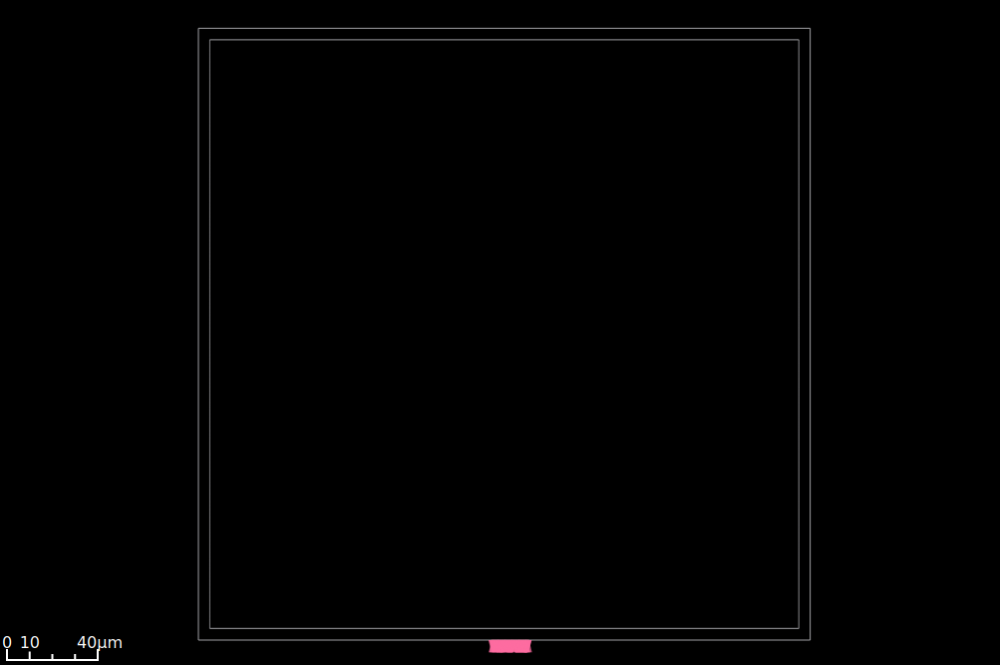
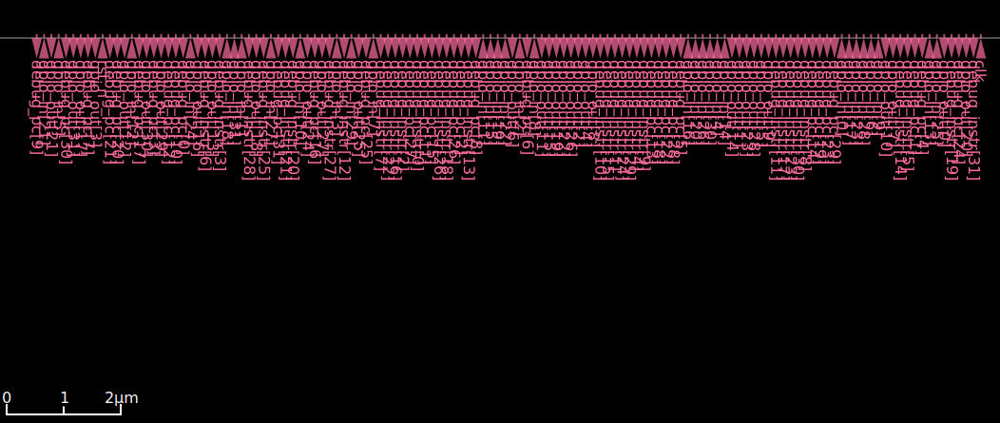
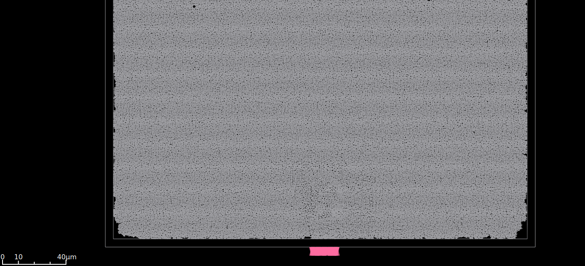
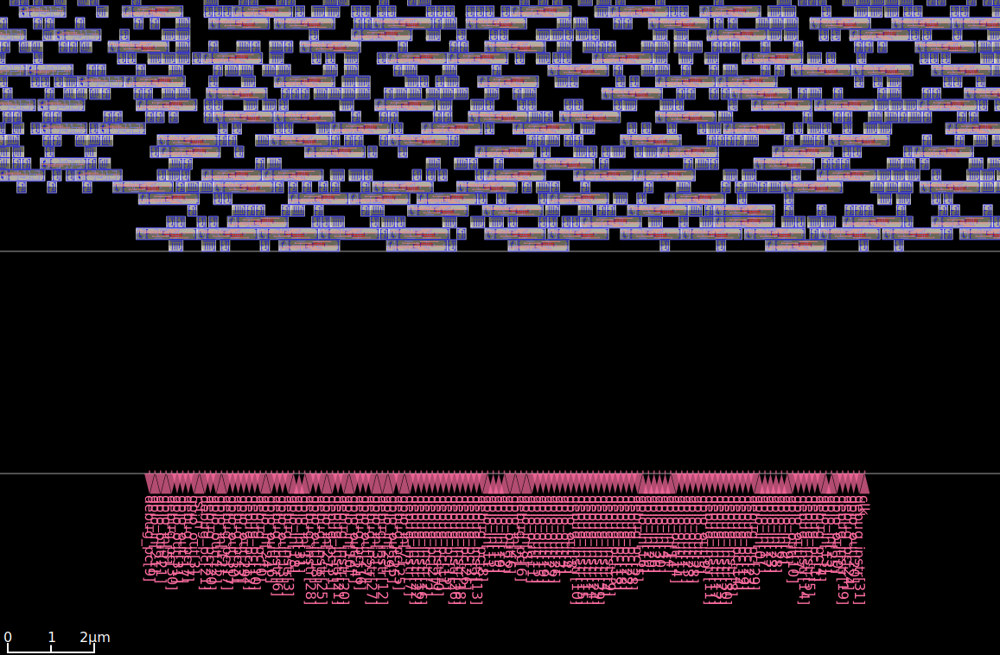
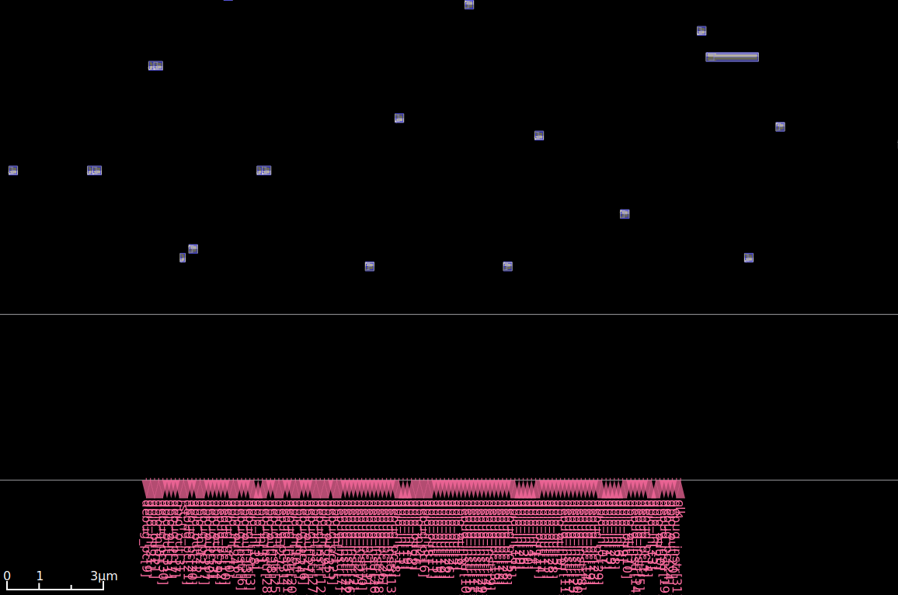
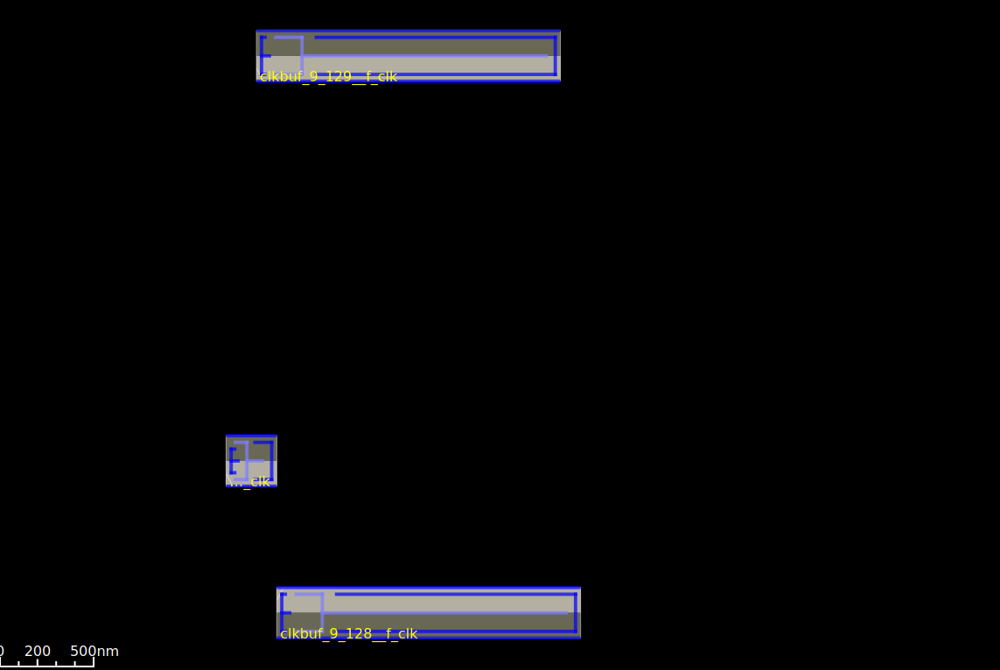

# RISC-V RV32I Physical Design Project - ASAP7 (7nm)

## Project Overview

| Attribute | Value |
|-----------|-------|
| **Design** | RISC-V RV32I 5-Stage Pipeline CPU |
| **Target PDK** | ASAP7 (7nm FinFET) |
| **Target Frequency** | 500 MHz (2ns period) |
| **Estimated Gates** | ~200K (with synthesized SRAMs) |
| **Tools** | Yosys + OpenROAD |

## Architecture

```
┌─────────────────────────────────────────────────────────────────┐
│                         riscv_soc                               │
│  ┌──────────────────────────────────────────────────────────┐  │
│  │                     riscv_core                           │  │
│  │  ┌─────┐  ┌─────┐  ┌─────┐  ┌─────┐  ┌─────┐           │  │
│  │  │ IF  │→ │ ID  │→ │ EX  │→ │ MEM │→ │ WB  │           │  │
│  │  └─────┘  └─────┘  └─────┘  └─────┘  └─────┘           │  │
│  │     ↑        │        │                                  │  │
│  │     └────────┴────────┘ (Forwarding & Hazard)           │  │
│  └──────────────────────────────────────────────────────────┘  │
│  ┌────────────┐  ┌────────────┐  ┌────────────┐               │
│  │   IMEM     │  │    DMEM    │  │    GPIO    │               │
│  │   4KB      │  │    4KB     │  │   32-bit   │               │
│  └────────────┘  └────────────┘  └────────────┘               │
└─────────────────────────────────────────────────────────────────┘
```

## Progress Tracker

### Phase 1: RTL Design ✅
- [x] RISC-V package (opcodes, constants)
- [x] Register file (32x32-bit)
- [x] ALU (all RV32I operations)
- [x] Instruction decoder
- [x] Branch unit
- [x] Hazard detection & forwarding
- [x] Pipeline registers (IF/ID, ID/EX, EX/MEM, MEM/WB)
- [x] Memory controller
- [x] SRAM model
- [x] Top-level SoC

### Phase 2: Synthesis ✅
- [x] Verify RTL syntax with Yosys
- [x] Run synthesis
- [x] Analyze gate count
- [x] Technology mapping to ASAP7 cells

**Synthesis Results (2025-12-20):**

| Metric | Value |
|--------|-------|
| Total Cells | ~201,740 |
| Flip-flops | 34,393 |
| Combinational Logic | ~167,347 |
| Netlist Size | 23 MB |

**Cell Distribution:**

| Cell Type | Count | Description |
|-----------|-------|-------------|
| NAND2xp33_ASAP7 | 117,764 | 2-input NAND |
| NAND3xp33_ASAP7 | 36,348 | 3-input NAND |
| DFFHQNx1_ASAP7 | 32,800 | D Flip-flop (SRAM) |
| NAND4xp25_ASAP7 | 12,826 | 4-input NAND |
| DFFASRHQNx1_ASAP7 | 1,593 | DFF with async reset |
| XOR2x2_ASAP7 | 42 | 2-input XOR |
| Others | ~367 | NOR, MAJ, OR, XNOR |

**Note:** The large flip-flop count (32,800) comes from the 2x 4KB SRAMs synthesized as registers. In a real design, these would be replaced by SRAM macros.

### Phase 3: Floorplanning ✅
- [x] Define die area
- [x] Create routing tracks
- [x] Place I/O pins
- [x] Analyze utilization

**Floorplan Results (2025-12-22):**

| Metric | Value |
|--------|-------|
| Die Area | 40,372 µm² |
| Core Area | ~37,000 µm² |
| Utilization | 60% |
| Aspect Ratio | 1.0 (square) |
| I/O Pins | 130 |
| Site | asap7sc7p5t |

**Configuration:**
- Horizontal pin layer: M6
- Vertical pin layer: M7
- Core margin: 5 µm

**Note:** No SRAM macros in this design (SRAMs synthesized as flip-flops). In production, SRAM macros would be placed during floorplanning.

**Screenshots:**



### Phase 4: Placement ✅
- [x] Global placement
- [x] Detailed placement
- [x] Verify placement
- [x] Generate reports

**Placement Results (2025-12-22):**

| Metric | Value |
|--------|-------|
| Design Area | 40,372 µm² |
| Utilization | 60% |
| Total Cells | 391,300 |
| Sequential Cells | 67,193 |
| Combinational Cells | 324,107 |
| Iterations (Global) | 486 |
| Final Overflow | 9.96% |
| HPWL (legalized) | 594,819 µm |

**Legalization Metrics:**
- Average displacement: 0.2 µm
- Max displacement: 0.8 µm
- Delta HPWL: +16%

**Note:** Timing violations are expected at this stage (no CTS yet, ideal clocks). The slack will improve after Clock Tree Synthesis.

**Screenshots:**



### Phase 5: Clock Tree Synthesis (CTS) ✅
- [x] Build clock tree (H-Tree topology)
- [x] Analyze skew
- [x] Buffer insertion
- [x] Verify timing

**CTS Results (2025-12-23):**

| Metric | Value |
|--------|-------|
| Clock Sinks (FF) | 67,193 |
| Clock Buffers Added | 5,307 |
| Leaf Buffers | 4,480 |
| Clock Tree Levels | 9 |
| Path Depth | 8-9 |
| **Skew** | **10.63 ps** |
| Avg Sink Wire Length | 390.22 µm |

**Configuration:**
- Root buffer: BUFx24_ASAP7_75t_R
- Buffer list: BUFx2, BUFx4, BUFx8, BUFx12
- Sink clustering diameter: 30 µm
- Sink clustering size: 15

**Note:** Timing violations remain large due to estimated parasitics. Real timing will be determined after routing.

**Screenshots:**



### Phase 6: Routing 🔲
- [ ] Global routing
- [ ] Detailed routing
- [ ] Fix DRC violations
- [ ] Antenna fixes

**Screenshot espace réservé:**


### Phase 7: Signoff 🔲
- [ ] Static Timing Analysis (STA)
- [ ] Power analysis
- [ ] DRC/LVS clean
- [ ] Final GDSII

**Screenshot espace réservé:**


---

## Files Structure

```
riscv-asap7/
├── README.md                 # This file (progress tracker)
├── docs/
│   └── images/              # Screenshots from OpenROAD GUI
├── src/
│   ├── riscv_pkg.v          # Constants & defines
│   ├── register_file.v      # 32x32 register file
│   ├── alu.v                # Arithmetic Logic Unit
│   ├── decoder.v            # Instruction decoder
│   ├── branch_unit.v        # Branch condition evaluation
│   ├── hazard_unit.v        # Hazard detection & forwarding
│   ├── memory_controller.v  # Load/Store unit
│   ├── pipeline_registers.v # All pipeline registers
│   ├── sram_32x1024.v       # SRAM model (4KB)
│   ├── riscv_core.v         # CPU core (5-stage pipeline)
│   └── riscv_soc.v          # Top-level SoC
├── constraints/
│   └── design.sdc           # Timing constraints
├── scripts/                 # TCL scripts for each phase
├── results/                 # Output files
└── reports/                 # Timing, area, power reports
```

---

## How to Run

### Test GUI OpenROAD
```bash
cd ~/projects/Physical-Design/riscv-asap7
openroad -gui
```

### Run Synthesis
```bash
cd ~/projects/Physical-Design/riscv-asap7
mkdir -p results/riscv_soc/01_synthesis
yosys -s scripts/01_synthesis.ys
```

---

## Notes & Observations

### Phase 2 - Synthesis Notes

**Leçons apprises:**
1. ABC (technology mapper) cannot read compressed `.lib.gz` files directly - need to decompress first
2. Yosys `.ys` scripts use `log` command instead of `echo` for messages
3. ASAP7 cells are split across multiple liberty files (SIMPLE, SEQ, INVBUF, AO, OA)

**Problèmes rencontrés:**
1. `ABC failed with status 8B` - Fixed by decompressing the liberty file
2. Duplicate `abc -liberty abc -liberty` typo in script

**Optimisations futures:**
1. Use SRAM macros instead of synthesized flip-flops to reduce cell count
2. Consider multi-Vt optimization (mix LVT/RVT/SLVT cells)

### Phase 3 - Floorplanning Notes

**Leçons apprises:**
1. ASAP7 tech LEF has negative offsets for some layers - need to manually define tracks with positive offsets
2. Site name found via `grep "^SITE" *.lef` → `asap7sc7p5t`
3. OpenROAD can read compressed `.lib.gz` files directly (unlike ABC in Yosys)

**Problèmes rencontrés:**
1. `IFP-0039: Layer M2 has negative routing track offset` - Fixed by manually defining tracks with `make_tracks` command
2. Wrong site name attempts (`asap7sc7p5t_RVT`, `asap7sc7p5t_28_R`) - Found correct name in LEF file

**Key concepts:**
- **Utilization**: Ratio of cell area to core area (60% = good balance between routing space and density)
- **Tracks**: Metal routing grid lines where wires can be placed
- **Pitch**: Distance between adjacent tracks (smaller = denser routing)

### Phase 4 - Placement Notes

**Leçons apprises:**
1. `global_placement -density` option is automatically adjusted if target density is too low for available area
2. ASAP7 LEF files don't have wire RC values defined - need to set manually or skip parasitics estimation
3. Overflow decreases as placement iterations progress (99% → 10%)

**Key concepts:**
- **HPWL (Half-Perimeter Wire Length)**: Estimation of total wire length - lower is better
- **Overflow**: Percentage of cells overlapping - must reach ~10% or less before legalization
- **Legalization (detailed_placement)**: Snaps cells to legal row positions, may increase HPWL slightly
- **Displacement**: How much cells moved during legalization (smaller = better global placement quality)

### Phase 5 - CTS Notes

**Leçons apprises:**
1. `set_wire_rc` must be called BEFORE `clock_tree_synthesis` to avoid CTS-0104 warning
2. ASAP7 doesn't have RC values in LEF - must set manually with `set_wire_rc -resistance -capacitance`
3. Smaller clustering diameter = more buffers but better skew

**Key concepts:**
- **H-Tree**: Balanced tree topology where clock is distributed hierarchically
- **Skew**: Difference in clock arrival time between flip-flops (target: < 5% of period)
- **Sink clustering**: Groups nearby flip-flops to share leaf buffers
- **CRPR (Clock Reconvergence Pessimism Removal)**: Removes pessimism in timing analysis for common clock paths
