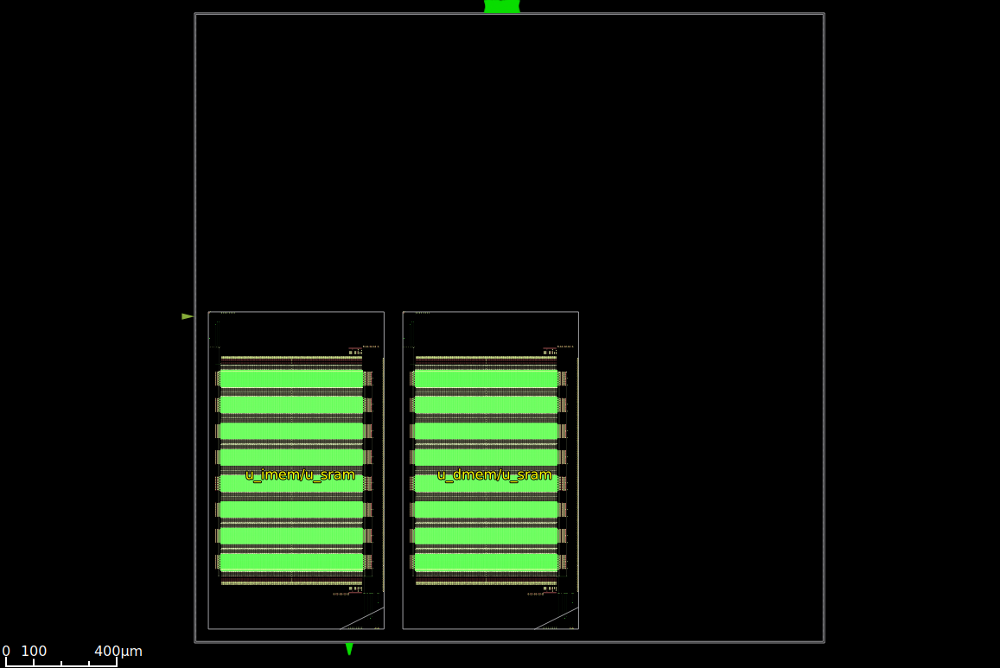
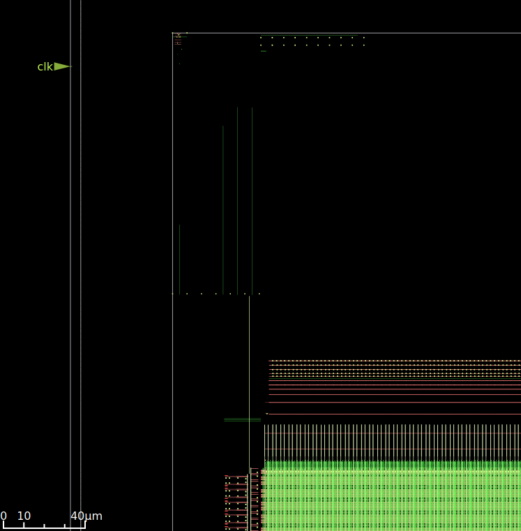
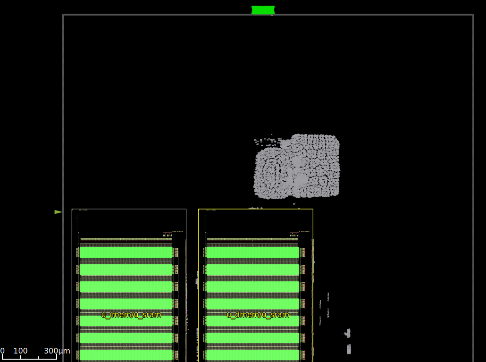
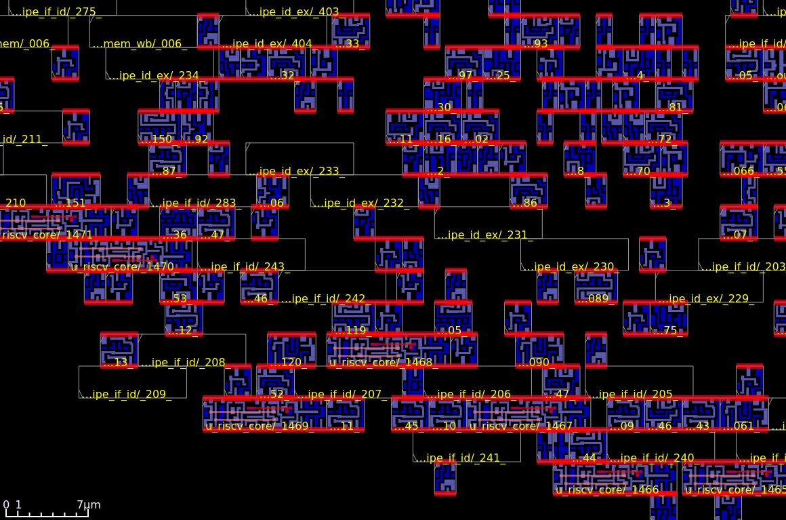
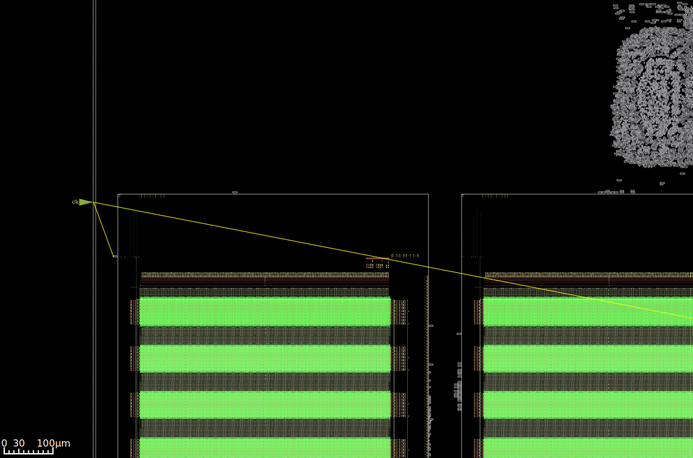
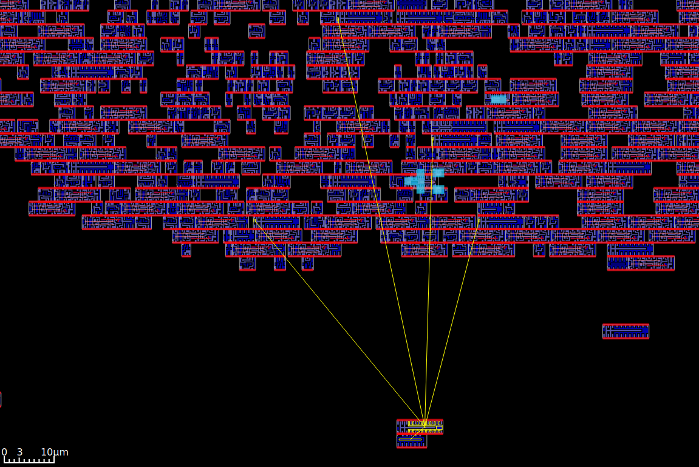
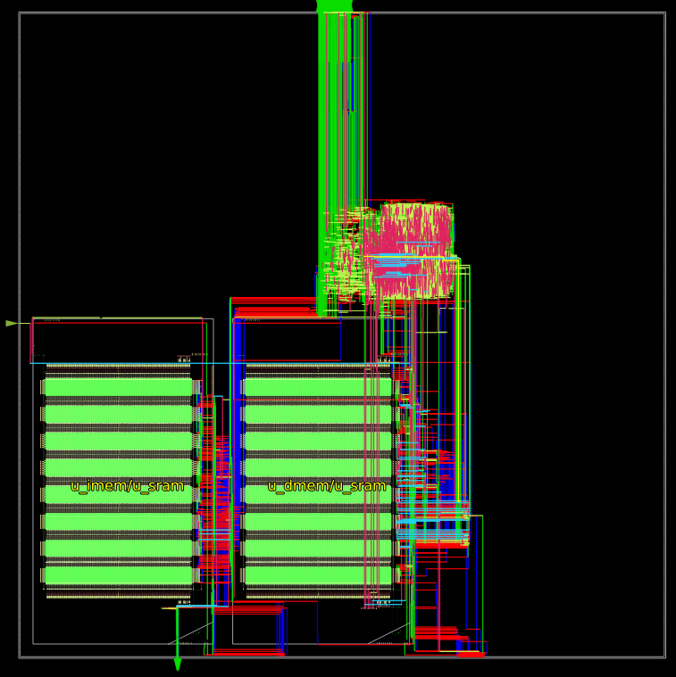
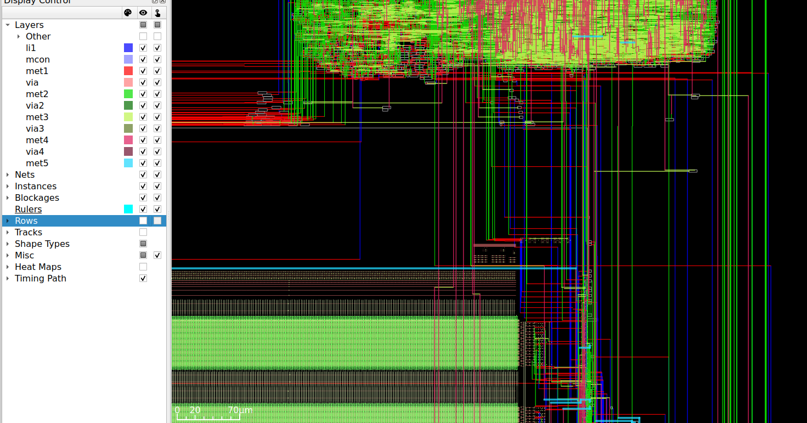

# RISC-V RV32I Physical Design Project - SKY130 (130nm)

## Project Overview

| Attribute | Value |
|-----------|-------|
| **Design** | RISC-V RV32I 5-Stage Pipeline CPU |
| **Target PDK** | SKY130 (130nm CMOS) |
| **Target Frequency** | 100 MHz (10ns period) |
| **Standard Cells** | sky130_fd_sc_hd (High Density) |
| **SRAM Macros** | sky130_sram_1rw1r_128x256_8 (OpenRAM) |
| **Tools** | Yosys + OpenROAD |

## Architecture

```
┌─────────────────────────────────────────────────────────────────┐
│                         riscv_soc                               │
│  ┌──────────────────────────────────────────────────────────┐  │
│  │                     riscv_core                           │  │
│  │  ┌─────┐  ┌─────┐  ┌─────┐  ┌─────┐  ┌─────┐           │  │
│  │  │ IF  │→ │ ID  │→ │ EX  │→ │ MEM │→ │ WB  │           │  │
│  │  └─────┘  └─────┘  └─────┘  └─────┘  └─────┘           │  │
│  │     ↑        │        │                                  │  │
│  │     └────────┴────────┘ (Forwarding & Hazard)           │  │
│  └──────────────────────────────────────────────────────────┘  │
│  ┌────────────────┐  ┌────────────────┐  ┌────────────┐       │
│  │   IMEM (SRAM)  │  │  DMEM (SRAM)   │  │    GPIO    │       │
│  │   4KB Macro    │  │   4KB Macro    │  │   32-bit   │       │
│  └────────────────┘  └────────────────┘  └────────────┘       │
└─────────────────────────────────────────────────────────────────┘
```

## SRAM Macro Details

### sky130_sram_1rw1r_128x256_8

| Parameter | Value |
|-----------|-------|
| Data Width | 128 bits |
| Depth | 256 words |
| Total Capacity | 32,768 bits (4 KB) |
| Write Granularity | 8 bits (byte-write) |
| Ports | 1RW + 1R (dual-access) |
| Technology | SKY130 |

### SRAM Wrapper

The `sram_wrapper_4kb` module adapts the 128-bit SRAM to a 32-bit interface:

```
External Interface (32-bit)          SRAM Macro (128-bit)
┌─────────────────────────┐         ┌─────────────────────────┐
│  addr[9:0]  ──────────────────→   │  addr[7:0] (256 rows)  │
│  (1024 words)           │         │                         │
│  ┌─────────────────┐    │         │  ┌───────────────────┐  │
│  │ addr[9:2] = row │────┼────────→│  │ Row select        │  │
│  │ addr[1:0] = col │    │         │  └───────────────────┘  │
│  └─────────────────┘    │         │                         │
│                         │         │  ┌───────────────────┐  │
│  din[31:0] ─────────────┼────────→│  │ din[127:0]        │  │
│  (replicated 4x)        │         │  │ (4 x 32-bit)      │  │
│                         │         │  └───────────────────┘  │
│  be[3:0] ───────────────┼────────→│  wmask[15:0]          │  │
│  (positioned by col)    │         │  (16 byte enables)     │  │
│                         │         │                         │
│  dout[31:0] ←───────────┼─────────│  dout[127:0]          │  │
│  (muxed by col)         │         │  (select 1 of 4)       │  │
└─────────────────────────┘         └─────────────────────────┘
```

---

## Progress Tracker

### Phase 1: RTL Design ✅
- [x] RISC-V package (opcodes, constants)
- [x] Register file (32x32-bit)
- [x] ALU (all RV32I operations)
- [x] Instruction decoder
- [x] Branch unit
- [x] Hazard detection & forwarding
- [x] Pipeline registers (IF/ID, ID/EX, EX/MEM, MEM/WB)
- [x] Memory controller
- [x] SRAM wrapper (128-bit to 32-bit adapter)
- [x] Top-level SoC with SRAM macros

### Phase 2: Synthesis ✅
- [x] Verify RTL syntax with Yosys
- [x] Run synthesis with SRAM blackboxed
- [x] Technology mapping to SKY130 cells
- [x] Analyze gate count

**Synthesis Results (2024-12-23):**

| Metric | Value |
|--------|-------|
| Chip Area (logic only) | 85,537 µm² |
| Sequential Area | 39,947 µm² (46.7%) |
| riscv_core | 81,000 µm² |
| sram_wrapper (×2) | 1,824 µm² each |
| SRAM Macros | 2 (blackboxed) |

**Top Cells:**

| Cell Type | Count | Description |
|-----------|-------|-------------|
| sky130_fd_sc_hd__dfxtp_1 | 1,593 | D Flip-flop |
| sky130_fd_sc_hd__mux2_1 | 1,041 | 2:1 Mux |
| sky130_fd_sc_hd__nand2_1 | 450 | 2-input NAND |
| sky130_fd_sc_hd__a21oi_1 | 222 | AND-OR-INV |
| sky130_fd_sc_hd__xnor2_1 | 101 | 2-input XNOR |
| sky130_sram_1rw1r_128x256_8 | 2 | SRAM Macro |

**Note:** SRAM macro area not included in chip area (blackboxed). Each SRAM macro is ~250×500 µm = 125,000 µm². Total with SRAMs: ~335,000 µm².

### Phase 3: Floorplanning ✅
- [x] Define die area
- [x] Place SRAM macros
- [x] Create routing tracks
- [x] Place I/O pins
- [x] Analyze utilization

**Floorplan Results (2024-12-23):**

| Metric | Value |
|--------|-------|
| Die Area | 2265 × 2262 µm |
| Core Area | 2255 × 2252 µm |
| Design Area | 1,529,756 µm² |
| Utilization | 30% |
| SRAM Macro Size | 632 × 1142 µm (R90) |
| SRAM Placement | Side-by-side |
| I/O Pins | 130 |
| Initial WNS | -4.58 ns |

**Screenshots:**





### Phase 4: Placement ✅
- [x] Global placement
- [x] Detailed placement
- [x] Timing optimization (repair_design, repair_timing)
- [x] Verify placement
- [x] Generate reports

**Placement Results (2024-12-23):**

| Metric | Value |
|--------|-------|
| Design Area | 1,529,756 µm² |
| Placement Density | 60% |
| WNS (before optimization) | -4.58 ns |
| WNS (after optimization) | -0.16 ns |
| Buffers Inserted | 636 |
| Cells Resized | 128 |

**Optimization Details:**
- `repair_design`: Inserted buffers for fanout and slew violations
- `repair_timing`: Resized cells and added buffers for setup timing
- Wire RC estimation using met2 (signal) and met5 (clock)

**Screenshots:**





### Phase 5: Clock Tree Synthesis (CTS) ✅
- [x] Build clock tree
- [x] Clock to SRAM macros
- [x] Buffer insertion (clkbuf_1 to clkbuf_16)
- [x] Post-CTS timing optimization
- [x] Analyze skew

**CTS Results (2024-12-23):**

| Metric | Value |
|--------|-------|
| Clock Network Delay | ~1.45-1.63 ns |
| WNS (after CTS) | -0.68 ns |
| WNS (after post-CTS opt) | -0.46 ns |
| Root Buffer | sky130_fd_sc_hd__clkbuf_16 |
| Buffer Types | clkbuf_1/2/4/8/16 |

**CTS Configuration:**
- Sink clustering enabled (max diameter: 30µm, size: 15)
- Wire RC: met2 (signal), met5 (clock)
- Post-CTS `repair_timing` for data path optimization

**Critical Path (post-CTS):**
- SRAM IMEM → mux4 → buffer → debug_instr output
- Output path limited by 2ns external delay constraint

**Screenshots:**





### Phase 6: Routing ✅
- [x] Global routing
- [x] Detailed routing
- [x] Multi-threading (10 threads on Mac M4)
- [x] Tie-net fix (one_/zero_ reclassified as SIGNAL)

**Routing Results (2024-12-24):**

| Metric | Value |
|--------|-------|
| Routing Layers | li1-met5 (signal), met3-met5 (clock) |
| DEF Size | 14 MB (236K lines) |
| Tie Nets Fixed | 7 (one_, zero_, hierarchical) |

**Key Fixes Applied:**
- PDN setup with `add_global_connection` for VPWR/VPB/VGND/VNB
- Tie-cell nets (one_, zero_) reclassified from POWER/GROUND to SIGNAL
- Pattern matching for hierarchical names (u_dmem/one_, u_imem/zero_, etc.)

**Screenshots:**





### Phase 7: Signoff 🔲
- [ ] Static Timing Analysis (STA)
- [ ] Power analysis
- [ ] DRC/LVS clean
- [ ] Final GDSII

**Signoff Results:**

| Metric | Value |
|--------|-------|
| WNS (Setup) | - |
| TNS (Setup) | - |
| Power | - |

**Screenshots:**


---

## Files Structure

```
riscv-sky130/
├── README.md                 # This file (progress tracker)
├── docs/
│   └── images/              # Screenshots from OpenROAD GUI
│       ├── 02_floorplan/
│       ├── 03_placement/
│       ├── 04_cts/
│       ├── 05_routing/
│       └── 06_signoff/
├── src/
│   ├── riscv_pkg.v          # Constants & defines
│   ├── register_file.v      # 32x32 register file
│   ├── alu.v                # Arithmetic Logic Unit
│   ├── decoder.v            # Instruction decoder
│   ├── branch_unit.v        # Branch condition evaluation
│   ├── hazard_unit.v        # Hazard detection & forwarding
│   ├── memory_controller.v  # Load/Store unit
│   ├── pipeline_registers.v # All pipeline registers
│   ├── sram_wrapper_4kb.v   # SRAM macro wrapper
│   ├── riscv_core.v         # CPU core (5-stage pipeline)
│   └── riscv_soc.v          # Top-level SoC
├── constraints/
│   └── design.sdc           # Timing constraints (100 MHz)
├── scripts/
│   ├── 01_synthesis.ys      # Yosys synthesis script
│   ├── 02_floorplan.tcl     # Floorplanning (template)
│   ├── 03_placement.tcl     # Placement (template)
│   ├── 04_cts.tcl           # Clock Tree Synthesis (template)
│   ├── 05_routing.tcl       # Routing (template)
│   └── 06_signoff.tcl       # Signoff (template)
├── results/                 # Output files
│   └── riscv_soc/
│       └── 01_synthesis/
└── reports/                 # Timing, area, power reports
```

---

## How to Run

### Phase 1: Synthesis
```bash
cd ~/projects/Physical-Design/riscv-sky130
yosys -s scripts/01_synthesis.ys
```

### Phase 2+: OpenROAD Flow
```bash
cd ~/projects/Physical-Design/riscv-sky130
openroad scripts/02_floorplan.tcl
# ... etc
```

---

## Key Differences vs ASAP7 Project

| Aspect | ASAP7 (7nm) | SKY130 (130nm) |
|--------|-------------|----------------|
| Target Frequency | 500 MHz | 100 MHz |
| Clock Period | 2 ns | 10 ns |
| SRAM | Synthesized (flip-flops) | Real macros (OpenRAM) |
| Cell Library | asap7sc7p5t | sky130_fd_sc_hd |
| Metal Layers | 9 | 5 |
| Min Feature | 7 nm | 130 nm |
| VDD | 0.7 V | 1.8 V |

---

## Notes & Observations

### Phase 1 - RTL Notes

**Key changes from ASAP7:**
1. Added `sram_wrapper_4kb` to adapt 128-bit SRAM to 32-bit interface
2. Top-level SoC uses wrapper instead of behavioral SRAM model
3. Same CPU core architecture (fully compatible)

### SRAM Integration Notes

1. **Blackboxing**: SRAM macros are blackboxed during synthesis
2. **LEF for Physical**: SRAM LEF defines physical footprint
3. **LIB for Timing**: SRAM LIB provides timing arcs for STA
4. **GDS for Final**: SRAM GDS merged into final layout

### SKY130 Process Notes

1. **Process**: 130nm hybrid (5 metal layers)
2. **Operating voltage**: 1.8V typical
3. **Cell variants**:
   - `sky130_fd_sc_hd` - High Density (used here)
   - `sky130_fd_sc_hs` - High Speed
   - `sky130_fd_sc_ms` - Medium Speed
